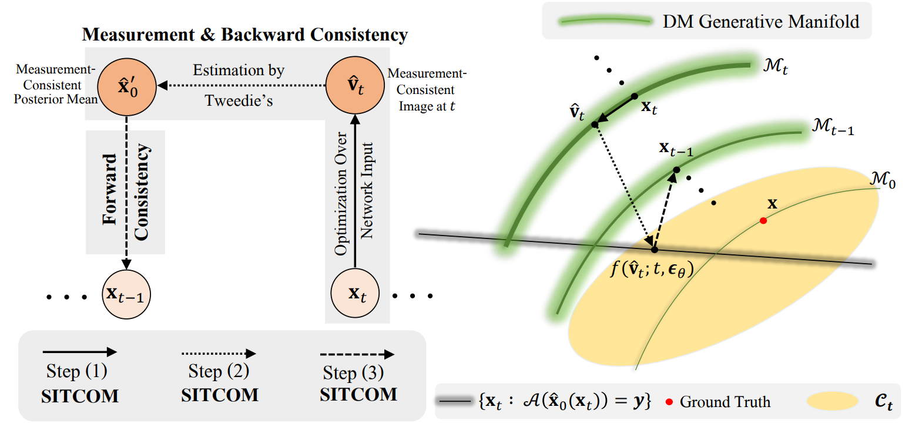
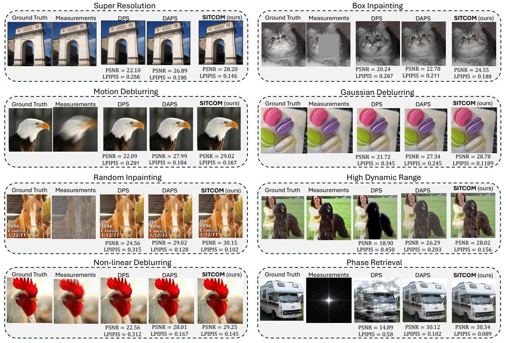
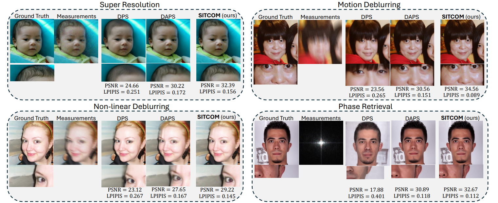

# SITCOM: Step-wise Triple-Consistent Diffusion \\Sampling for Inverse Problems

### Abstract: 
Diffusion models (DMs) are a class of generative models that allow sampling from a distribution learned over a training set. When applied to solving inverse imaging problems (IPs), the reverse sampling steps of DMs are typically modified to approximately sample from a measurement-conditioned distribution in the image space. However, these modifications may be unsuitable for certain settings (such as in the presence of measurement noise) and non-linear tasks, as they often struggle to correct errors from earlier sampling steps and generally require a large number of optimization and/or sampling steps. To address these challenges, we state three conditions for achieving measurement-consistent diffusion trajectories. Building on these conditions, we propose a new optimization-based sampling method that not only enforces the standard data manifold measurement consistency and forward diffusion consistency, as seen in previous studies, but also incorporates backward diffusion consistency that maintains a diffusion trajectory by optimizing over the input of the pre-trained model at every sampling step. By enforcing these conditions, either implicitly or explicitly, our sampler requires significantly fewer reverse steps. Therefore, we refer to our accelerated sampling method as **S**tep-w**i**se **T**riple-**Co**nsistent Sa**m**pling (**SITCOM**). Compared to existing state-of-the-art baseline methods, under different levels of measurement noise, our extensive experiments across five linear and three non-linear image restoration tasks demonstrate that SITCOM achieves competitive or superior results in terms of standard image similarity metrics while requiring a significantly reduced run-time across all considered tasks. 

## SITCOM Illustrative Diagram:


## ImageNet Results:

## FFHQ Results:


## Prerequisites
- python 3.8

- pytorch 1.11.0

- CUDA 11.3.1

- nvidia-docker (if you use GPU in docker container)

It is okay to use lower version of CUDA with proper pytorch version. For example, CUDA 10.2 with pytorch 1.7.0.

<br />

## Getting started 


### 1) Download pretrained checkpoint
From the [link](https://drive.google.com/drive/folders/1jElnRoFv7b31fG0v6pTSQkelbSX3xGZh?usp=sharing), download the checkpoint "ffhq_10m.pt" and paste it to ./models/
```
mkdir models
mv {DOWNLOAD_DIR}/ffqh_10m.pt ./models/
```
{DOWNLOAD_DIR} is the directory that you downloaded checkpoint to.

<br />


### 2) Set environment
### [Option 1] Local environment setting

We use the external codes for motion-blurring and non-linear deblurring, similar to DPS (see references below). 

```
git clone https://github.com/VinAIResearch/blur-kernel-space-exploring bkse

git clone https://github.com/LeviBorodenko/motionblur motionblur
```

Install dependencies

```
conda create -n new_diffusion python=3.8

conda activate new_diffusion

pip install torch
pip install numpy
pip install diffuser
pip install matplotlib

```


### 3) Inference

```
you can run python SITCOM.py for noise level with 0.01 case

for the noise case like 0.05
you can run python SITCOM_with_noise
```

For imagenet, use configs/imagenet_model_config.yaml

<br />

## Possible task configurations

```
# Linear inverse problems
- configs/super_resolution_config.yaml
- configs/gaussian_deblur_config.yaml
- configs/motion_deblur_config.yaml
- configs/inpainting_config.yaml

# Non-linear inverse problems
- configs/nonlinear_deblur_config.yaml
- configs/phase_retrieval_config.yaml
- configs/hdr.yaml
```

### Structure of task configurations
You need to write your data directory at data.root. Default is ./data/samples which contains 10 sample images from FFHQ validation set.

```

data:
    name: ffhq
    root: ./data/samples/

measurement:
    operator:
        name: # check candidates in guided_diffusion/measurements.py

noise:
    name:   # gaussian
    sigma:  # if you use name: gaussian, set this.
```

## Refrences: 
- Our implementation is based on [DPS](https://github.com/DPS2022/diffusion-posterior-sampling).
- Baselines: [DCDP](https://github.com/Morefre/Decoupled-Data-Consistency-with-Diffusion-Purification-for-Image-Restoration), [DAPS](https://github.com/zhangbingliang2019/DAPS), and [DDNM](https://github.com/wyhuai/DDNM).
 

  
