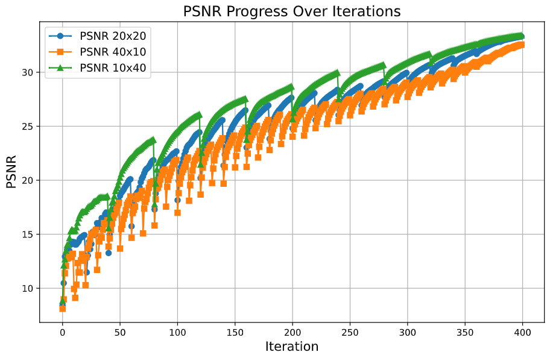
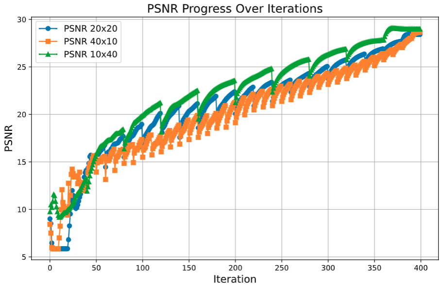

## Empirical Convergence Results for SITCOM

Here, we provide SITCOM PSNR curves of one linear and one non-linear task using different values of $N$ (sampling steps) and $K$ (number of gradient updates). 

The y-axis corresponds to the PSNR value, whereas the x-axis corresponds to $i\in {1,...,NK}$, i.e., we report the PSNR at each sampling and gradient steps. 

### Gaussian Deblurring

### High Dynamic Range

